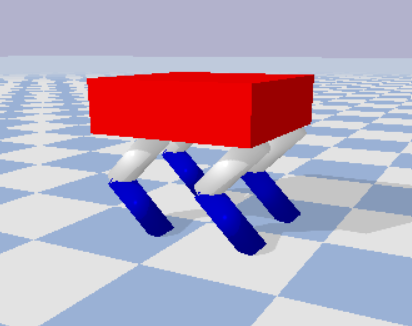
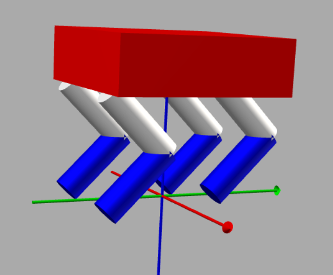

# Bonus Task 1

Note: This task is an optional task and will be considered as tiebreaker only if there is a tie among scores of participants. Attempt this task only if you have completed all previous tasks.

## Task - Development of a Quadruped Robot URDF
In this task, you are supposed to build a URDF of a quadruped robot. [Quadruped robots](https://en.wikipedia.org/wiki/Legged_robot) are mobile robots with leg mechanisms, which help in locomotion and are much more versatile than wheeled robots. 

The legs of the quadruped robot can be seen as inverted [2R planar robot arms](https://github.com/Robotics-Club-IIT-BHU/Robotics-Camp-2021/tree/main/Basics%20of%20pyBullet/Week%201/Subpart%202), something you worked with in subpart 2 of this week. This means that the base of the 2R arm will be on the main body/torso of the robot, and the legs will extend down. The joints in the legs will be revolute only. 

You are expected to build something like the following and load it in pybullet:

   
   

Note: It is not necessary that the robot should move, but it should have such a structure with all the necessary joints.
