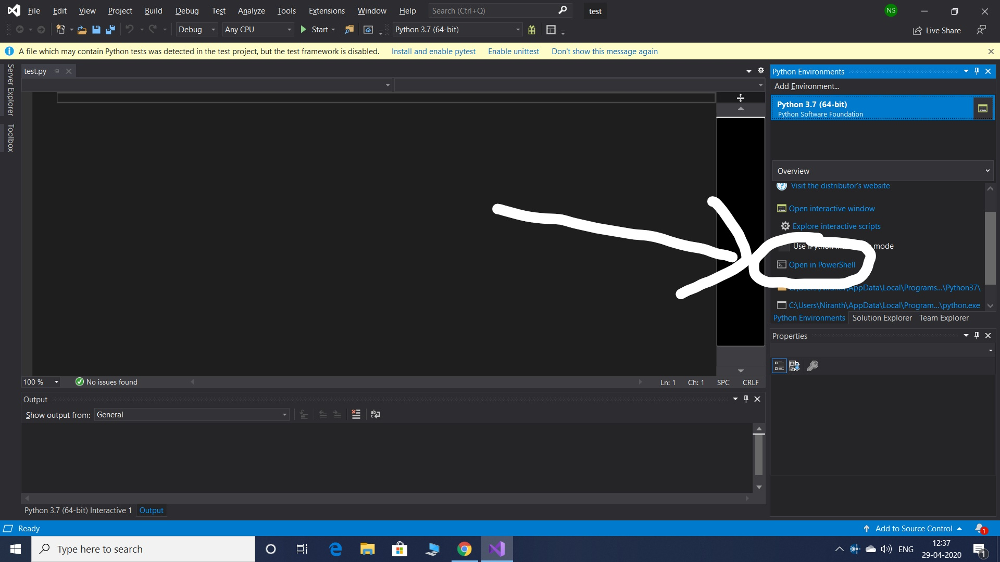

# Introduction and Installation

## What is  Simulation?
<p align="center">
   
</p>

   Well it sure is a possiblity !!!,do checkout this Simulation Theory 
   
[Is Reality Real? The Simulation Argument](https://www.youtube.com/watch?v=tlTKTTt47WE)

but before we loose hope on our very existence, lets first understand what it is !!

### Defined as: 
   Simulation software is based on the process of modeling a real phenomenon with a set of **mathematical formulas**. It is, essentially, a program that allows the user to observe an operation through simulation without actually performing that operation.Thus, it proves to be a very close proxy to the real-world i.e. a mathematical model of the real world processes. The simulation plays a very important role in robotics. Different tools are used for the analysis of kinematics(does not include the cause of motion), dynamics(includes the cause of motion) of robotic manipulators, for off-line programming, to design different control algorithms, to design mechanical structure of robots, to design robotic cells and production lines, etc.


## Simulation Vs Emulation:
Two of the terms that are often misused are simulation and emulation.

**Simulation** is when you are replicating, by the means of software, the general behavior of a system starting from a conceptual model.

Eg :- Softwares used by Space agencies to model the unknown planet conditions.

**Emulation** is when you are replicating, in a different system, how the original system internally works considering each function and their relations.

Eg:-Android emulators for windows like Bluestacks, Andy, etc

Thus, we as robotic technicians need a mathematical model of the world/environments and the physics that govern them, for us experimenting out our robots. Hence, simulation is what we do.

## Why use simulations?

* Simulations are the best place to start when developing a new robot. By using a simulator to develop your robot, you can quickly identify if your idea is feasible or not with almost no expense. Additionally, you can easily test and discover which are the physical constraints that your robot must face to accomplish its goal.
* Simulators allow the easy and quick test of many different ideas for the same robotic problem, test them, and then decide which one to build based on actual data.
* Since your robot has been defined and tested in the simulator, you can start its physical construction. The good thing with simulators is that they allow you to keep doing tests even if your robot is not built yet.
* Bugs found in your robot software can be debugged first in the simulator.
* By debugging in the simulator you will save a lot of time since testing on the real robot is very time-consuming.
* Given that simulation is the way to go, there are plenty of options available for robotics  namely Bullet, Gazebo, V-Rep, Webots, Open Dynamics Engine, MujoCo, etc.

## PyBullet
Bullet is a **physics engine** that simulates **collision detection, soft and rigid body dynamics**. It has been used in video games as well as for visual effects in movies.PyBullet is an easy to use Python module for physics simulation, robotics, and deep reinforcement learning based on the Bullet Physics SDK.

Given the options, the reason for selecting PyBullet is,
* It's a lightweight software and opens source with an active community.
* Built for python development, hence gives more informative and clear approach for beginners. 
* No external dependencies except a fully working python interpreter.

Here are some simulations in PyBullet:

<p align="center">
   
</p>
<p align="center">
   
</p>
<p align="center">
   
</p>


## Installation of PyBullet

The installation of PyBullet is as simple as:
(sudo)`pip install PyBullet` (Python 2.x), 
`pip3 install PyBullet`
This will expose the PyBullet module as well as pybullet_envs Gym environments.

If you are getting Visual C++ version issues in Windows, then

1. Uninstall any python platform such as anaconda, python IDLE, visual studio including visual studio basic tools and related softwares and restart the machine (Just to be on safer side, make a clean installation).
2. Install python IDLE v3.7.7 from [here](https://www.python.org/ftp/python/3.7.7/python-3.7.7-amd64.exe), you can go for the latest one too which is supported by your machine, but just because older versions are more compatible, here v3.7.7 is included. During installation check mark add to path option.
3. Install visual studio basic tools from [here](https://drive.google.com/file/d/1rhnHXYUMPnS9Z3ygkJMOJ40bkZiTSonF/view?usp=drivesdk). This is the web based setup. If you are able to successfully install visual studio basic tools then jump to step 6.
4. If you get an error while installing visual studio basic tools such as .Net framework 4.5 or above is required then install it from [here](https://www.microsoft.com/en-in/download/details.aspx?id=30653). This link is for framework 4.5 you can install the latest one too, which is supported by your machine. If you don't get any error in this them jump to Step 6.
5. While installation of .Net framework, if you get error such as package is not applicable to your computer, that's mostly because service pack update is missing, or if it says that a particular update package is needed, then kindly update your windows through windows update, or try searching for that particular update package on the web.
6. Open command prompt (cmd.exe), type command
   ```pip install wheel pybullet```
7. Open python IDLE this will open the shell, under file tab click new, in newly opened window you can type your code and run it.

#### If the above process doesn't work for windows users then try: 

1. Install Visual Studio 2019 Community version [here](https://visualstudio.microsoft.com/downloads/).
2. In the setup, in workloads select “Python Development” and “Desktop development with C++”.
3. After installation, launch Visual Studio and create a new python project.
4. Goto Tools>Python>Python Environments.
5. In the Overview bar on the right side, select “Open in Powershell”
<p align="center">
   
</p>

6. Once your Powershell pops up, type “pip3 install PyBullet” and press enter.
7. You can install any python package using pip in the Powershell.
8. Try running this example code:
```python
import pybullet as p
import time
import pybullet_data
physicsClient = p.connect(p.GUI)#or p.DIRECT for non-graphical version
p.setAdditionalSearchPath(pybullet_data.getDataPath()) #optionally
p.setGravity(0,0,-10)
planeId = p.loadURDF("plane.urdf")
cubeStartPos = [0,0,1]
cubeStartOrientation = p.getQuaternionFromEuler([0,0,0])
boxId = p.loadURDF("r2d2.urdf",cubeStartPos, cubeStartOrientation)
for i in range (10000):
    p.stepSimulation()
    time.sleep(1./240.)
cubePos, cubeOrn = p.getBasePositionAndOrientation(boxId)
print(cubePos,cubeOrn)
p.disconnect()
```
**Contact us if you face any difficulties with the installation.**
